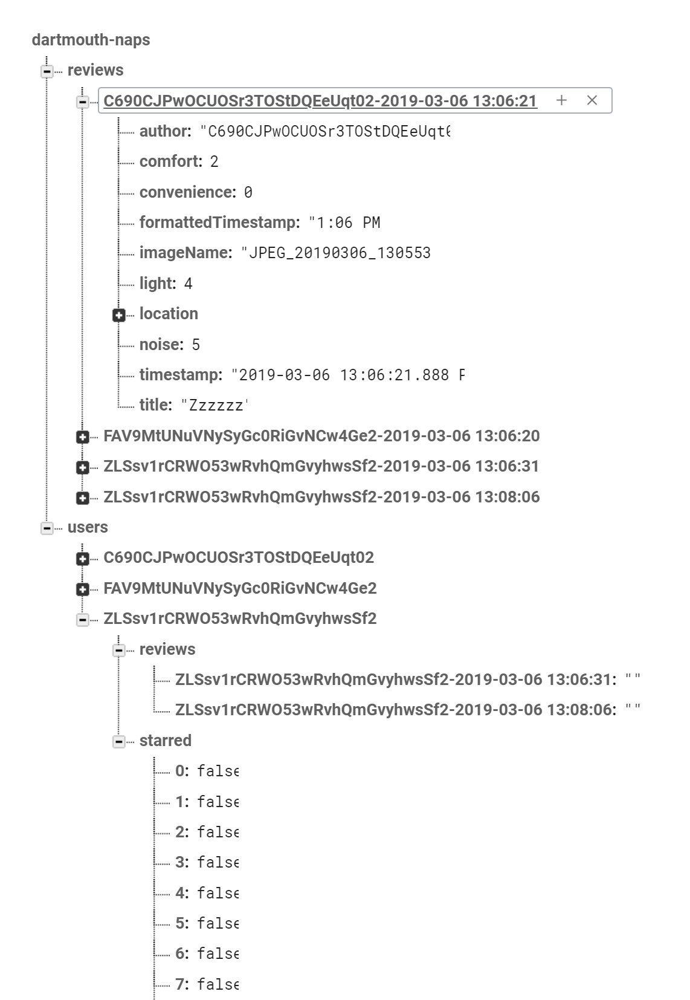

# Dartmouth Naps
An Android application for Dartmouth students to review and discover good napping locations


## Demo or Die Day Presentation
<https://docs.google.com/presentation/d/1g_pP2hewEOnoEQBFb5L0MENmGiFbGKjGDC3G1E6F3KY/edit?usp=sharing>

## Setup
There are few requirements that must be met:

* Android device runs on Android 8.1 (Oreo) or later
* Internet Access

### Github

One way to use the app is through this github repository. First, clone the repository
```
git clone https://github.com/ijemmao/dartmouth-naps.git
```

Open project in Android Studio, then clean and rebuild the project
```
Build > Clean Project
Build > Rebuild Project
```

Then Press the Play button to run the app!🎉

### APKs

Another way to use the app is to download one of these APKs. The only difference between the two of them is the preset period for the review prompt `Notification`. One of them has a period of 1 min, meaning after 1 min of the application still being active (potentially pushed to the back, but the location monitor `Notification` keeps it considered active), but with the `CampusMapFragment` not active, the review prompt `Notification` will be posted. With this occurring after 1 min, it can sometimes pop up if the user is in other `Activity`s for long enough, which seems odd, but this wouldn't occur with a more realistic time period of 30 min, 1 hr, or 2 hr. Do display this, our second APK is a 15-min version, which more accurately reflects the UX of the review prompt `Notification`, but in a mediary timespan that isn't too short nor too long.

* [1-min APK](https://github.com/ijemmao/dartmouth-naps/raw/master/DartmouthNaps_1m_5s.apk)
* [15-min APK](https://github.com/ijemmao/dartmouth-naps/blob/master/DartmouthNaps_15m_2m.apk)

## Design and Presentation Resources

### [Ijemma's Original Pitch](https://docs.google.com/presentation/d/1U5dV4e1Yy2UXnjdFKumxm2BsX1pRqz_PSnM95fFhmMM/edit?usp=sharing)

### [Our Figma Boards](https://www.figma.com/file/QXj3MVCTs4YBLTcY7DXWIkBS/Dartmouth-Naps?node-id=0%3A1)

### [Demo or Die Day Presentation](https://docs.google.com/presentation/d/1g_pP2hewEOnoEQBFb5L0MENmGiFbGKjGDC3G1E6F3KY/edit?usp=sharing)

## System Designs

### Client Side

#### Activities

##### Main Activity

##### Login and Sign up Activities

##### New Review and Review Activities
These `Activity`s are fairly similar in visual appearance; however, they have different functionality and purpose for the overall user experience.

The `NewReviewActivity` allows the user to create a new review by providing an image of their location, a short title, and a rating between 1-5 for the noise, comfort, and light quality. Users are unable to upload their review if they fail to provide any of details.

This activity makes use of the `RatingFragment`.

The `ReviewActivity` show cases all the data the review with the addition of convenience, which is calculated based on the user's location.

This activity makes use of the `RatingFragment` but disabling the buttons that are within the fragment.

#### Fragments

##### Campus Map Fragment
The bottom 40% of the screen is occupied by the `ReviewCardContainerFragment`, with a `SupportMapFragment` in the background displaying campus. This `SupportMapFragment` has been stylized through adjustments made on a JSON string from the [Google Maps Platform Styling Wizard](https://mapstyle.withgoogle.com/). `Review`s are marked on the map with the [bed marker](https://github.com/ijemmao/dartmouth-naps/blob/master/DartmouthNaps/app/src/main/res/drawable/ic_marker_bed.xml), and the user's current location is marked on the map with the [sheos marker](https://github.com/ijemmao/dartmouth-naps/blob/master/DartmouthNaps/app/src/main/res/drawable/ic_marker_shoes.xml). When the user taps on one of the pins, the map centers on that pin, and if it was a `Review` pin, the `ReviewCardContainerFragment` sets the corresponding `ReviewCardFragment` to be active.

##### Review Card Fragment
Each Review object is represented with a Review Card Fragment that is overlaid on the `CampusMapFragment`.

##### Review Card Container Fragment
This fragment contains all the `ReviewCardFragment`s which allows for swiping functionality. On swiping, the `SupportMapFragment` centers on the associated `Review`.

##### Rating Fragment
The Noise, Comfort, and Light ratings all implement the Rating fragment which makes for keeping track of the unique statuses for each Review fairly simple.

##### Starred Location Fragment

##### My Reviews Fragment
The user has the ability to see all of their active reviews. On this view, they only have the option to delete their reviews.

#### Async Logic

##### Location Service

The `LocationService` (started and bound to the `CampusMapFragment` by proxy of the `MainActivity` through use of a callback interface) keeps track of the user's location through use of a `FusedLocationProviderClient`. When the `CampusMapFragment` is in the foreground, the `Service` is bound, and the locations are handled through a `LocationRequest` and a custom `LocationCallback`, `LSLocationCallback`. However, the `Service`handles locations very differently depending on whether or not its bound. When not bound, the `LocationService` instead uses a `CheckLocationPeriodicallyThread`, which calls `sleep()` for `PERIOD_IN_MILLIS` ms in between calls to `run()` on a `CheckLocationPeriodicallyRunnable`. The `Thread` terminates by calling `interrupt()`, which is called in `onDestroy()` of the `LocationService`. The `CheckLocationPeriodicallyRunnable` uses a `CheckLocationPeriodicallyOnSuccessListener` to handle the location. If the difference in milliseconds between A) the first time the location was determined to be in the current Place and B) the current time when `onSuccess()` is called is greater `THRESHHOLD_IN_MILLIS`, a prompt review `Notification` is posted (with the most recent latitude and longitude stored in its intent), and a flag is set to prevent another prompt review `Notification` from being posted without first moving from that place zone.

To keep the app running even when pushed to the background, the `LocationService` also posts a location monitor `Notification`, which just alerts the user that their location is being tracked. By posting this Notification through the the `Service` class's `startForeground()` function, the application isn't killed by Android as it tries to allocate space, only closing once the user closes the apps from the active applications screen, or force closes it in Settings.

##### Image Loading Thread

Firebase for Android doesn't provide the capability to complete multiple async tasks at the same time (similar to Javascript's `Promise` class). Because of this limitation, Java's `Future` class was used to synchronously complete async tasks.

Completing multiple `Future` tasks is computationally heavy on the main UI thread. Therefore, this logic was moved out to an AsyncTask named `ImageLoadTask`, which is called every time there is a change in the database so the user see the most up-to-date list of reviews.

##### Add Places To Map AsyncTask

Because the near 1,000+ coordinates that define the place `Polygon`s defined in `PlaceUtil` would likely weigh down the main UI thread more than it should, the process of looping through these coordinates and adding them to `PolygonOptions` objects was offloaded to `AddPlacesToMapAT`, which then adds them to the `GoogleMap` in `onPostExecute()`.

### Controller

#### Firebase Data Source

`FirebaseDataSource` serves as a center for interacting with the Firebase DB. It uses a `ReviewsChildEventListener` to listen to `Review`s being added to or removed from the DB and call the appropriate functions to make sure that the local `List`s and `Map`s of these `Review`s reflect these remote changes. A second `ChildEventListener`, `StarredChildEventListener`, is similarly listening to the children of the `starred` item for the user in the DB. When these functions are called, it sets the appropriate `boolean` in a private array, `mStarred`, which represents whether or not the user has starred that place index. Using this array, the `FirebaseDataSource` checks in `ReviewsChildEventListener.onChildAdded()` to see if the user should receive a starred review `Notification`, and sends one accordingly if necessary.

#### Notification Center

Because there are a lot of similarities between the different `Notification`s and what they require before being posted, the utility `NotificationCenter` was created to manage this. A static member of `LocationService`, `NotificationCenter` handles all the `NotificationManager` and `NotificationChannel` intialization, and uses the private function `postNotification()` to create the actual `Notification` itself and add all the necessary extras to the `Intent`. External classes can use `NotificationCenter` by calling one of its three public post functions, `postLocationMonitorNotification()`, `postReviewPromptNotification()`, and `postStarredReviewNotification()`.

### Models

#### LatLng

##### Variables

```Java
double latitude
double longitude
```

##### Functions

```Java
// There are typical getter and setter functions

public Google.LatLng toGoogleLatLng() {
  // Returns a Google LatLng from original LatLng
}

public Location toLocation() {
  // Returns a Location from original LatLng
}
```


#### Review
This is class that includes all information related to review objects

##### Variables
```Java
String author    // Fireabse uid of the user
int noise        // Rating of the noise quality
int comfort      // Rating of the comfort quality
int light        // Rating of the light quality
int convenience  // Rating of the convenience of review
String title     // Title of the review
String imageName // Name of the review's image
byte[] image     // Data of image
String timestamp // Time when review was created
```

##### Functions
```Java
// There are typical getter and setter functions

public String getFormattedTimestamp() {
  // Returns a formatted time stamp for users
}

public static String getTimeStampFromCalendar(Calendar timestampCal) {
  // Returns the time when review was created
}

public Map<String, Object> toMap() {
  // Returns a Map representation of Review
}
```

### Database Structure



## Technology

* [Android](https://developer.android.com/docs) - Pure Java was used to develop the application. This application supports API levels 27 and higher (Android 8.1 - Oreo).
* [Firebase](https://firebase.google.com/docs/android/setup) - Stored review and user information.

## Acknowledgements
We would like to thank Professor Xing-Dong Yang and Varun Mishra GR for their support and guidance through creating this application.
