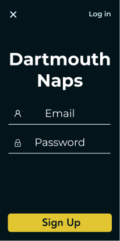

# Dartmouth Naps
An Android application for Dartmouth students to review and discover good napping locations




## Setup
There are few requirements that must be met:

* Android device runs on Android 8.1 (Oreo) or later
* Internet Access

### GitHub

Clone the repository
```
git clone https://github.com/ijemmao/dartmouth-naps.git
```

Open project in Android Studio, then clean and rebuild the project
```
Build > Clean Project
Build > Rebuild Project
```

Then Press the Play button to run the app!🎉

### APK Links

We have two different versions of our APK available, the only difference being a timer setting for one of the notifications. The 15 minute version reflects a slightly more realistic use version, but the time scope is a bit large for a presentation. The 1 minute version, on the other hand, is much less realistic (the notification sometimes fires at weird moments that wouldn't happen on the 15 minute version), but it allows the user to experience the notification without waiting for too long.

* [15-min APK](https://github.com/ijemmao/dartmouth-naps/raw/master/DartmouthNaps_15m_2m.apk)
* [1-min APK](https://github.com/ijemmao/dartmouth-naps/raw/master/DartmouthNaps_1m_5s.apk)

## System Design

### Design Documents

#### The Dream That Started It All, [Ijemmma's Original Pitch](https://docs.google.com/presentation/d/1U5dV4e1Yy2UXnjdFKumxm2BsX1pRqz_PSnM95fFhmMM/edit?usp=sharing)

#### [Our Figma Boards](https://www.figma.com/file/QXj3MVCTs4YBLTcY7DXWIkBS/Dartmouth-Naps?node-id=0%3A1)

#### [Our Demo or Die Day Presentation](https://docs.google.com/presentation/d/1g_pP2hewEOnoEQBFb5L0MENmGiFbGKjGDC3G1E6F3KY/edit?usp=sharing)

### Client Side

#### Activities

##### Main Activity

##### Login and Sign up Activities

##### New Review and Review Activities
These fragments are fairly similar in visual appearance; however, they have different functionality and purpose for the overall user experience.

The `NewReviewActivity` allows the user to create a new review by providing an image of their location, a short title, and a rating between 1-5 for the noise, comfort, and light quality. Users are unable to upload their review if they fail to provide any of details.

This activity makes use of the `RatingFragment`.

The `ReviewActivity` show cases all the data the review with the addition of convenience, which is calculated based on the user's location.

This activity makes use of the `RatingFragment` but disabling the buttons that are within the fragment.

#### Fragments

##### Map Fragment

##### Review Card Fragment
Each Review object is represented with a Review Card Fragment that is overlaid on the `CampusMapFragment`.

##### Review Card Container Fragment
This fragment contains all the `ReviewCardFragment`s which allows for swiping functionality.

##### Rating Fragment
The Noise, Comfort, and Light ratings all implement the Rating fragment which makes for keeping track of the unique statuses for each Review fairly simple.

##### Starred Location Fragment

##### My Reviews Fragment
The user has the ability to see all of their active reviews. On this view, they only have the option to delete their reviews.

#### Async Logic

##### Location Tracking Service

##### Image Loading Thread
Firebase for Android doesn't provide the capability to complete multiple async tasks at the same time (similar to Javascript's `Promise` class). Because of this limitation, Java's `Future` class was used to synchronously complete async tasks.

Completing multiple `Future` tasks is computationally heavy on the main UI thread. Therefore, this logic was moved out to an AsyncTask named `ImageLoadTask`, which is called every time there is a change in the database so the user see the most up-to-date list of reviews.

### Controller

### Models

#### LatLng

##### Variables

```Java
double latitude
double longitude
```

##### Functions

```Java
// There are typical getter and setter functions

public Google.LatLng toGoogleLatLng() {
  // Returns a Google LatLng from original LatLng
}

public Location toLocation() {
  // Returns a Location from original LatLng
}
```


#### Review
This is class that includes all information related to review objects

##### Variables
```Java
String author    // Fireabse uid of the user
int noise        // Rating of the noise quality
int comfort      // Rating of the comfort quality
int light        // Rating of the light quality
int convenience  // Rating of the convenience of review
String title     // Title of the review
String imageName // Name of the review's image
byte[] image     // Data of image
String timestamp // Time when review was created
```

##### Functions
```Java
// There are typical getter and setter functions

public String getFormattedTimestamp() {
  // Returns a formatted time stamp for users
}

public static String getTimeStampFromCalendar(Calendar timestampCal) {
  // Returns the time when review was created
}

public Map<String, Object> toMap() {
  // Returns a Map representation of Review
}
```

### Database Structure

## Technology

* [Android](https://developer.android.com/docs) - Pure Java was used to develop the application. This application supports API levels 27 and higher (Android 8.1 - Oreo).
* [Firebase](https://firebase.google.com/docs/android/setup) - Stored review and user information.

## Acknowledgements
We would like to thank Professor Xing-Dong Yang and Varun Mishra GR for their support and guidance through creating this application.